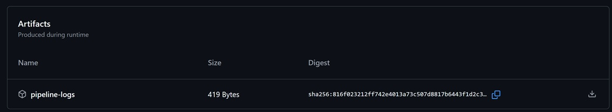
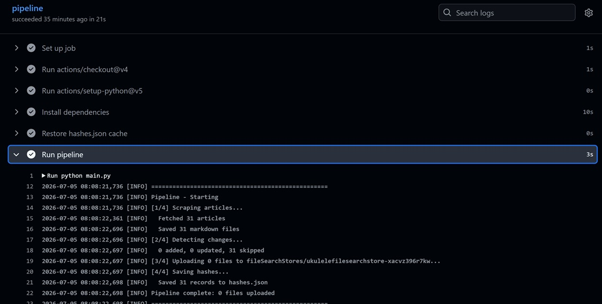
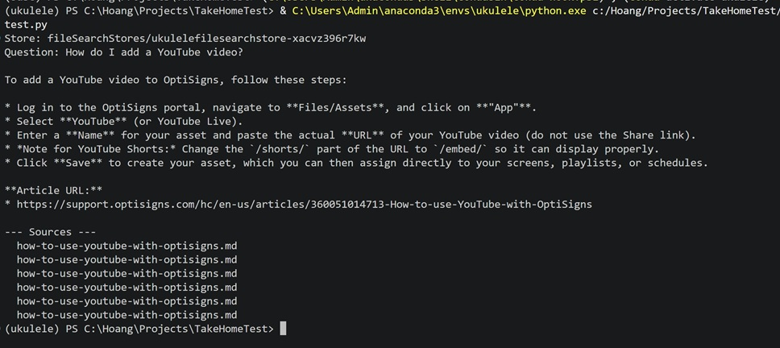

# Help Center Pipeline

End-to-end pipeline that scrapes articles, converts to Markdown, uploads to **Google Gemini File Search Store**, and serves an AI assistant that answers only from the uploaded documents.

## Architecture

```
Zendesk API ──► scrape.py ──► articles/*.md ──► main.py ──► Gemini File Search Store
                                                      │
                                              hashes.json (SHA256 delta detection)
                                                      │
                                              test.py (chat assistant)
```

```
project/
├── main.py              # Pipeline orchestration
├── scrape.py            # Zendesk scraper + markdown converter
├── upload.py            # Upload all .md to File Search Store
├── check.py             # Dry-run delta detection
├── test.py              # Interactive chat with the store
├── temp.py              # Delete all store documents
├── articles/            # Generated markdown files
├── hashes.json          # SHA256 + doc_name tracking
├── logs/                # Pipeline logs
├── requirements.txt     # Python dependencies
├── Dockerfile           # Containerization
├── .dockerignore
├── .env.sample          # Environment variables template
└── .github/workflows/   # Daily CI/CD
```

## Setup

### 1. Clone & create `.env`

```bash
git clone <repo-url>
cd <project-dir>
cp .env.sample .env
```

Fill in `.env`:

```env
API_KEY = your_gemini_api_key
```

### 2. Install dependencies

```bash
pip install -r requirements.txt
```

## How to Run

### Full pipeline (scrape → detect → upload → save hashes)

```bash
python main.py
```

Output:
```
[1/4] Scraping articles...
  Fetched 31 articles
  Saved 31 markdown files
[2/4] Detecting changes...
  2 added, 5 updated, 24 skipped
[3/4] Uploading 7 files to fileSearchStores/...
  [1/7] new-article.md
    -> Done (fileSearchStores/.../documents/...)
[4/4] Saving hashes...
  Saved 31 records to hashes.json
Pipeline complete: 7 files uploaded
```

### Interactive chat

```bash
python test.py
```

## Docker

```bash
docker build -t main.py .
docker run --rm -e API_KEY=your_key -v $(pwd)/hashes.json:/app/hashes.json main.py
```

Container runs once and exits 0. Mount `hashes.json` for delta persistence.

## Daily Job (GitHub Actions)

Runs daily at 6:00 UTC (`.github/workflows/daily.yml`).

| Step | Action |
|---|---|
| Checkout | Clone repo |
| Restore cache | Load `hashes.json` from previous run |
| Run `main.py` | Scrape → detect → upload delta |
| Upload artifact | `pipeline-logs` available in Actions tab |

**Setup:** Add `API_KEY` to repo → Settings → Secrets and variables → Actions.

**Logs:** Go to your repo → [Actions tab](https://github.com/HoangVu109/suparmegaukulele/actions/workflows/daily.yml) → latest run → Artifacts → `pipeline-logs`


Or you can see logs in Pipeline → Run pipline



## Chunk Strategy

| Parameter | Value |
|---|---|
| Method | White-space chunking (`WhiteSpaceConfig`) |
| Tokens per chunk | 500 (API max: 512) |
| Overlap tokens | 100 (~20%) |

Gemini splits documents by white-space boundaries with 100-token overlap to preserve context across chunk boundaries.


## Screenshot


Assistant answering "How do I add a YouTube video?"
## Delta Sync

`hashes.json` tracks each file:

```json
{
  "article-slug.md": {
    "hash": "sha256...",
    "doc_name": "fileSearchStores/.../documents/..."
  }
}
```

| State | Action |
|---|---|
| New file | Upload |
| Hash changed | Delete old doc → upload new |
| Unchanged | Skip |

